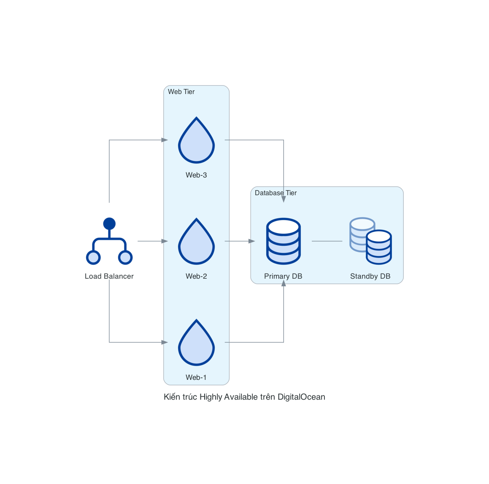
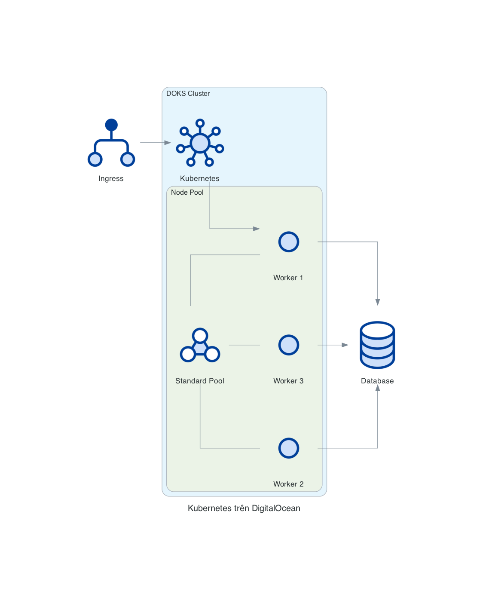

# DigitalOcean Compute Nodes

Các nodes Compute trong DigitalOcean đại diện cho các dịch vụ tính toán như Droplets (máy chủ ảo), Kubernetes và Containers. Đây là những dịch vụ cốt lõi mà hầu hết các ứng dụng trên DigitalOcean sẽ sử dụng.

## Danh sách Nodes

### Droplet
`Droplet` là máy chủ ảo của DigitalOcean, tương đương với EC2 của AWS hay VM của Google Cloud. Droplets là nền tảng cho hầu hết các ứng dụng trên DigitalOcean.

```python
from diagrams.digitalocean.compute import Droplet
```

### DropletSnapshot
`DropletSnapshot` đại diện cho bản snapshot của một Droplet, cho phép bạn sao lưu trạng thái của máy chủ ảo tại một thời điểm cụ thể.

```python
from diagrams.digitalocean.compute import DropletSnapshot
```

### DropletConnect
`DropletConnect` đại diện cho kết nối đến Droplet, thường được sử dụng để biểu diễn SSH hoặc các phương thức kết nối khác.

```python
from diagrams.digitalocean.compute import DropletConnect
```

### K8SCluster
`K8SCluster` đại diện cho DigitalOcean Kubernetes (DOKS), dịch vụ Kubernetes được quản lý của DigitalOcean.

```python
from diagrams.digitalocean.compute import K8SCluster
```

### K8SNode
`K8SNode` đại diện cho một node trong cluster Kubernetes.

```python
from diagrams.digitalocean.compute import K8SNode
```

### K8SNodePool
`K8SNodePool` đại diện cho một nhóm các node trong cluster Kubernetes có cùng cấu hình.

```python
from diagrams.digitalocean.compute import K8SNodePool
```

### Containers
`Containers` đại diện cho dịch vụ container trên DigitalOcean.

```python
from diagrams.digitalocean.compute import Containers
```

### Docker
`Docker` đại diện cho Docker trên DigitalOcean, thường được sử dụng kết hợp với Droplets.

```python
from diagrams.digitalocean.compute import Docker
```

## Các Pattern Diagram phổ biến

### 1. Ứng dụng Web đơn giản

Mô tả một ứng dụng web đơn giản chạy trên một Droplet:

```python
from diagrams import Diagram
from diagrams.digitalocean.compute import Droplet
from diagrams.digitalocean.network import LoadBalancer
from diagrams.digitalocean.database import DbaasPrimary

with Diagram("Ứng dụng Web đơn giản trên DigitalOcean", show=False):
    lb = LoadBalancer("Load Balancer")
    app = Droplet("Web Server")
    db = DbaasPrimary("Database")
    
    lb >> app >> db
```


### 2. Kiến trúc Highly Available với nhiều Droplets

Mô tả một ứng dụng có tính sẵn sàng cao với nhiều Droplets:

```python
from diagrams import Diagram, Cluster
from diagrams.digitalocean.compute import Droplet
from diagrams.digitalocean.network import LoadBalancer
from diagrams.digitalocean.database import DbaasPrimary, DbaasStandby

with Diagram("Kiến trúc Highly Available trên DigitalOcean", show=False):
    lb = LoadBalancer("Load Balancer")
    
    with Cluster("Web Tier"):
        web_nodes = [Droplet("Web-1"),
                    Droplet("Web-2"),
                    Droplet("Web-3")]
    
    with Cluster("Database Tier"):
        primary = DbaasPrimary("Primary DB")
        standby = DbaasStandby("Standby DB")
        
        primary - standby
    
    lb >> web_nodes >> primary
```



### 3. Kiến trúc Kubernetes trên DigitalOcean

Mô tả một ứng dụng chạy trên DigitalOcean Kubernetes Service (DOKS):

```python
from diagrams import Diagram, Cluster
from diagrams.digitalocean.compute import K8SCluster, K8SNodePool, K8SNode
from diagrams.digitalocean.network import LoadBalancer
from diagrams.digitalocean.database import DbaasPrimary

with Diagram("Kubernetes trên DigitalOcean", show=False):
    lb = LoadBalancer("Ingress")
    
    with Cluster("DOKS Cluster"):
        k8s = K8SCluster("Kubernetes")
        
        with Cluster("Node Pool"):
            nodes = [K8SNode("Worker 1"),
                    K8SNode("Worker 2"),
                    K8SNode("Worker 3")]
            
            node_pool = K8SNodePool("Standard Pool")
            node_pool - nodes
    
    db = DbaasPrimary("Database")
    
    lb >> k8s >> nodes
    nodes >> db
```



## Các Best Practices

1. **Sử dụng Clusters**: Nhóm các nodes liên quan vào các clusters để làm rõ cấu trúc của hệ thống.
2. **Sử dụng màu sắc**: Tùy chỉnh màu sắc của các nodes để phân biệt giữa các môi trường hoặc vai trò khác nhau.
3. **Thêm labels rõ ràng**: Đặt tên cho các nodes một cách rõ ràng để người đọc dễ hiểu.
4. **Hiển thị kết nối**: Sử dụng các mũi tên để hiển thị luồng dữ liệu hoặc phụ thuộc giữa các thành phần.
