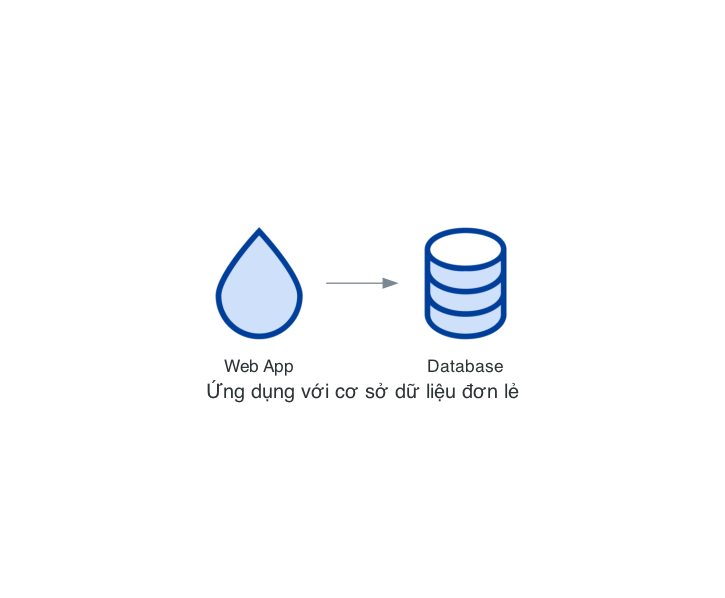
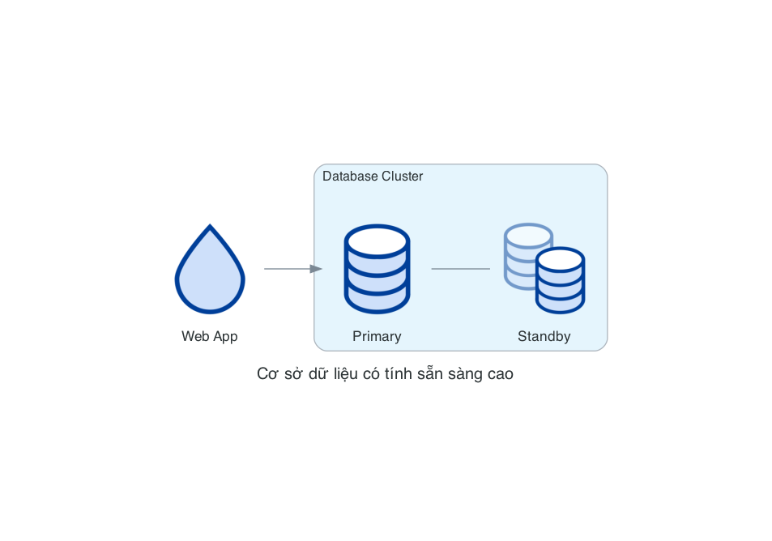
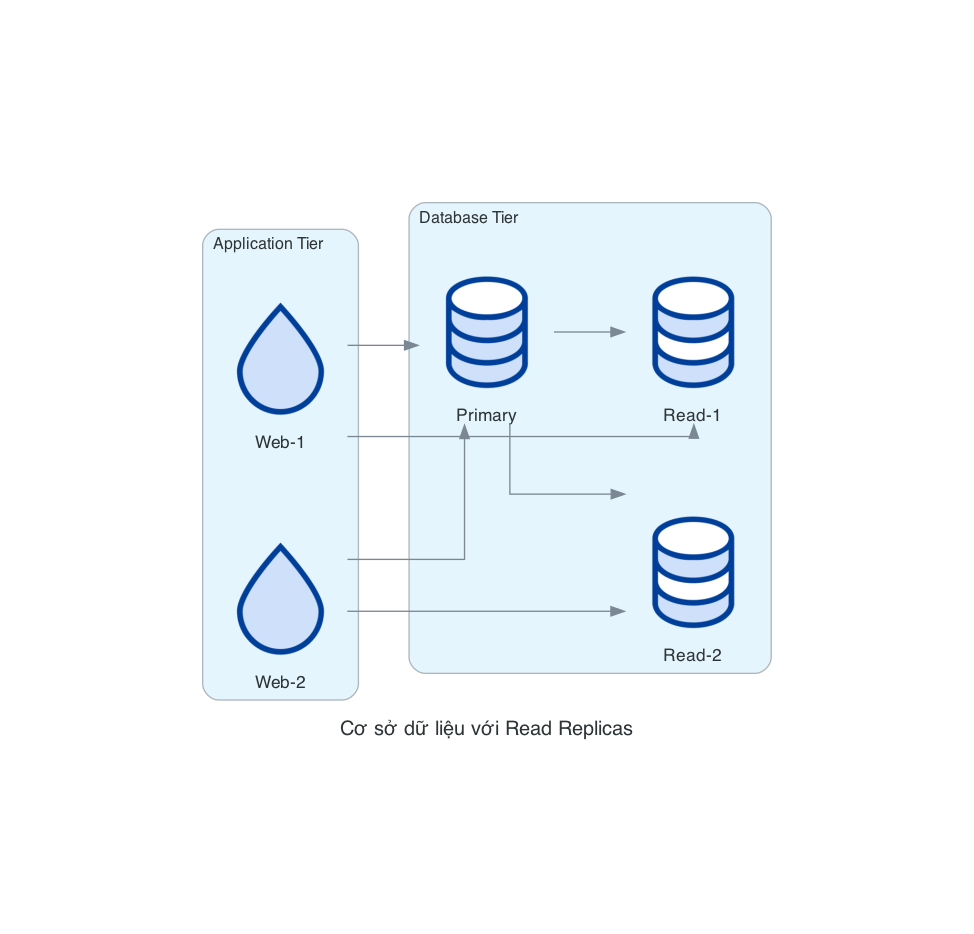
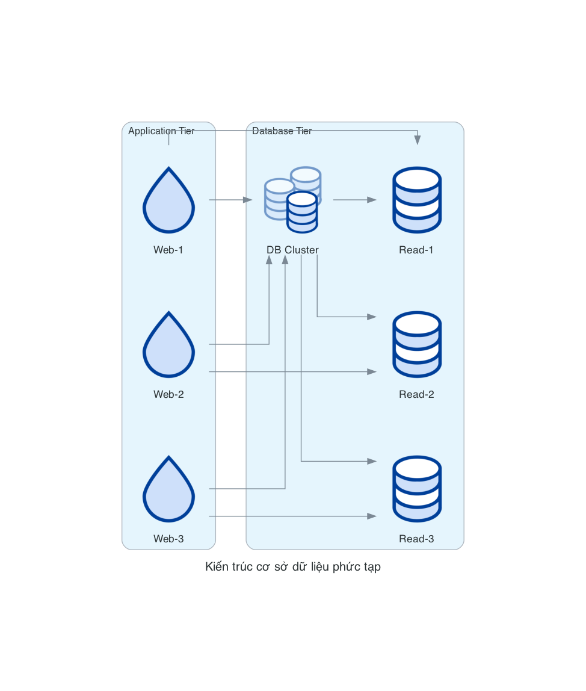

# DigitalOcean Database Nodes

Các nodes Database trong DigitalOcean đại diện cho các dịch vụ cơ sở dữ liệu được quản lý (Managed Databases). DigitalOcean cung cấp nhiều loại cơ sở dữ liệu như MySQL, PostgreSQL, Redis và MongoDB, tất cả đều được quản lý hoàn toàn.

## Danh sách Nodes

### DbaasPrimary
`DbaasPrimary` đại diện cho cơ sở dữ liệu chính trong một cụm cơ sở dữ liệu. Đây là nơi diễn ra tất cả các hoạt động ghi dữ liệu.

```python
from diagrams.digitalocean.database import DbaasPrimary
```

### DbaasStandby
`DbaasStandby` đại diện cho cơ sở dữ liệu dự phòng, sẵn sàng tiếp quản nếu cơ sở dữ liệu chính gặp sự cố. Nó thường được đồng bộ hóa với cơ sở dữ liệu chính thông qua replication.

```python
from diagrams.digitalocean.database import DbaasStandby
```

### DbaasReadOnly
`DbaasReadOnly` đại diện cho các replicas chỉ đọc của cơ sở dữ liệu. Các replicas này có thể được sử dụng để phân tán tải đọc và cải thiện hiệu suất.

```python
from diagrams.digitalocean.database import DbaasReadOnly
```

### DbaasPrimaryStandbyMore
`DbaasPrimaryStandbyMore` đại diện cho một cụm cơ sở dữ liệu phức tạp hơn với một primary, một standby và có thể có thêm các replicas khác.

```python
from diagrams.digitalocean.database import DbaasPrimaryStandbyMore
```

## Các Pattern Diagram phổ biến

### 1. Cơ sở dữ liệu đơn lẻ

Mô tả một ứng dụng sử dụng một cơ sở dữ liệu đơn lẻ:

```python
from diagrams import Diagram
from diagrams.digitalocean.compute import Droplet
from diagrams.digitalocean.database import DbaasPrimary

with Diagram("Ứng dụng với cơ sở dữ liệu đơn lẻ", show=False):
    app = Droplet("Web App")
    db = DbaasPrimary("Database")
    
    app >> db
```



### 2. Cơ sở dữ liệu có tính sẵn sàng cao

Mô tả một ứng dụng sử dụng cơ sở dữ liệu có tính sẵn sàng cao với primary và standby:

```python
from diagrams import Diagram, Cluster
from diagrams.digitalocean.compute import Droplet
from diagrams.digitalocean.database import DbaasPrimary, DbaasStandby

with Diagram("Cơ sở dữ liệu có tính sẵn sàng cao", show=False):
    app = Droplet("Web App")
    
    with Cluster("Database Cluster"):
        primary = DbaasPrimary("Primary")
        standby = DbaasStandby("Standby")
        
        primary - standby
    
    app >> primary
```



### 3. Cơ sở dữ liệu với Read Replicas

Mô tả một ứng dụng sử dụng cơ sở dữ liệu với các read replicas để phân tán tải đọc:

```python
from diagrams import Diagram, Cluster
from diagrams.digitalocean.compute import Droplet
from diagrams.digitalocean.database import DbaasPrimary, DbaasReadOnly

with Diagram("Cơ sở dữ liệu với Read Replicas", show=False):
    with Cluster("Application Tier"):
        apps = [Droplet("Web-1"),
               Droplet("Web-2")]
    
    with Cluster("Database Tier"):
        primary = DbaasPrimary("Primary")
        
        read_replicas = [DbaasReadOnly("Read-1"),
                        DbaasReadOnly("Read-2")]
        
        primary >> read_replicas
    
    apps >> primary
    apps >> read_replicas
```



### 4. Kiến trúc cơ sở dữ liệu phức tạp

Mô tả một kiến trúc cơ sở dữ liệu phức tạp với primary, standby và read replicas:

```python
from diagrams import Diagram, Cluster
from diagrams.digitalocean.compute import Droplet
from diagrams.digitalocean.database import DbaasPrimaryStandbyMore, DbaasReadOnly

with Diagram("Kiến trúc cơ sở dữ liệu phức tạp", show=False):
    with Cluster("Application Tier"):
        apps = [Droplet("Web-1"),
               Droplet("Web-2"),
               Droplet("Web-3")]
    
    with Cluster("Database Tier"):
        db_cluster = DbaasPrimaryStandbyMore("DB Cluster")
        
        read_replicas = [DbaasReadOnly("Read-1"),
                        DbaasReadOnly("Read-2"),
                        DbaasReadOnly("Read-3")]
        
        db_cluster >> read_replicas
    
    apps >> db_cluster
    apps >> read_replicas
```



## Các Best Practices

1. **Sử dụng Standby cho tính sẵn sàng cao**: Luôn cân nhắc sử dụng standby database cho các ứng dụng quan trọng.
2. **Sử dụng Read Replicas cho hiệu suất**: Sử dụng read replicas để phân tán tải đọc và cải thiện hiệu suất.
3. **Phân tách luồng đọc/ghi**: Hiển thị rõ ràng luồng đọc và ghi trong sơ đồ để dễ hiểu hơn.
4. **Nhóm các thành phần liên quan**: Sử dụng clusters để nhóm các thành phần cơ sở dữ liệu liên quan.
