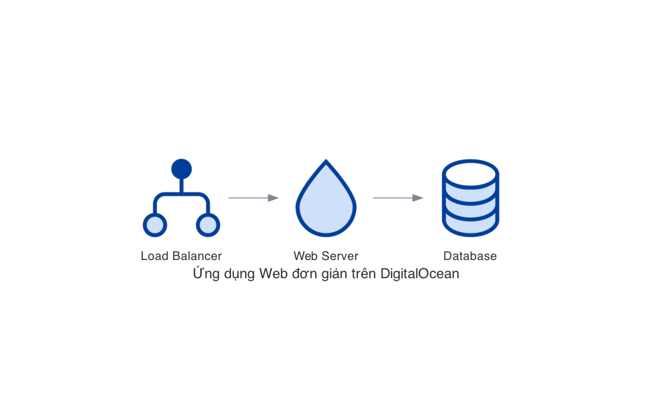

# Hướng dẫn sử dụng DigitalOcean Nodes trong Diagrams

Chào mừng bạn đến với tài liệu hướng dẫn sử dụng các nodes DigitalOcean trong thư viện Diagrams! Tài liệu này sẽ giúp bạn hiểu rõ về các nodes DigitalOcean có sẵn trong thư viện và cách sử dụng chúng để tạo các sơ đồ kiến trúc chuyên nghiệp.

## Nội dung

1. [Tổng quan về DigitalOcean Nodes](overview.md)
2. [Compute Nodes](compute.md)
3. [Database Nodes](database.md)
4. [Network Nodes](network.md)
5. [Storage Nodes](storage.md)
6. [Các Pattern Diagram phổ biến](patterns.md)
7. [Hướng dẫn tạo hình ảnh minh họa](generate_images.md)

## Giới thiệu

DigitalOcean là một nhà cung cấp dịch vụ đám mây phổ biến, đặc biệt được ưa chuộng bởi các nhà phát triển và doanh nghiệp nhỏ nhờ vào sự đơn giản và chi phí hợp lý. Thư viện Diagrams cung cấp nhiều nodes để biểu diễn các dịch vụ và tài nguyên của DigitalOcean trong các sơ đồ kiến trúc.

Với tài liệu này, bạn sẽ học cách:
- Sử dụng các nodes DigitalOcean trong thư viện Diagrams
- Hiểu ý nghĩa và mục đích của từng node
- Áp dụng các pattern diagram phổ biến
- Tạo các sơ đồ kiến trúc chuyên nghiệp

## Cài đặt

Để bắt đầu, bạn cần cài đặt thư viện Diagrams:

```bash
pip install diagrams
```

Thư viện này yêu cầu Graphviz, vì vậy bạn cũng cần cài đặt Graphviz:

- Trên macOS:
  ```bash
  brew install graphviz
  ```

- Trên Ubuntu/Debian:
  ```bash
  apt-get install graphviz
  ```

- Trên Windows:
  Tải và cài đặt từ [trang web chính thức của Graphviz](https://graphviz.org/download/).

## Ví dụ đơn giản

Dưới đây là một ví dụ đơn giản về cách sử dụng các nodes DigitalOcean:

```python
from diagrams import Diagram
from diagrams.digitalocean.compute import Droplet
from diagrams.digitalocean.network import LoadBalancer
from diagrams.digitalocean.database import DbaasPrimary

with Diagram("Ứng dụng Web đơn giản", show=True):
    lb = LoadBalancer("Load Balancer")
    app = Droplet("Web Server")
    db = DbaasPrimary("Database")
    
    lb >> app >> db
```

Kết quả:



## Tài liệu tham khảo

- [Tài liệu chính thức của Diagrams](https://diagrams.mingrammer.com/)
- [Tài liệu về DigitalOcean Nodes](https://diagrams.mingrammer.com/docs/nodes/digitalocean)
- [GitHub Repository của Diagrams](https://github.com/mingrammer/diagrams)

Hãy khám phá các tài liệu chi tiết trong các phần tiếp theo để hiểu rõ hơn về từng loại node và cách sử dụng chúng!
