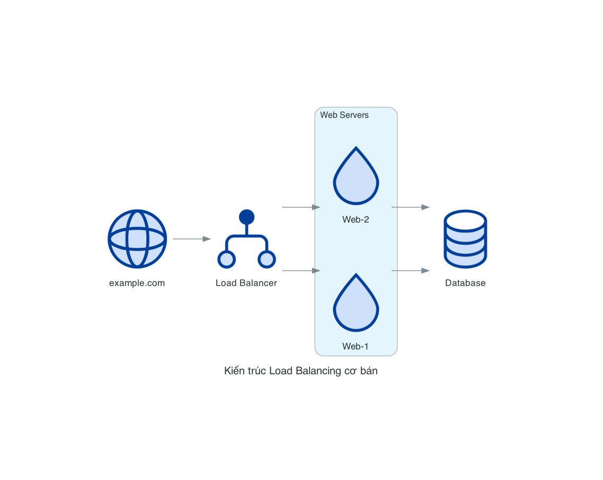
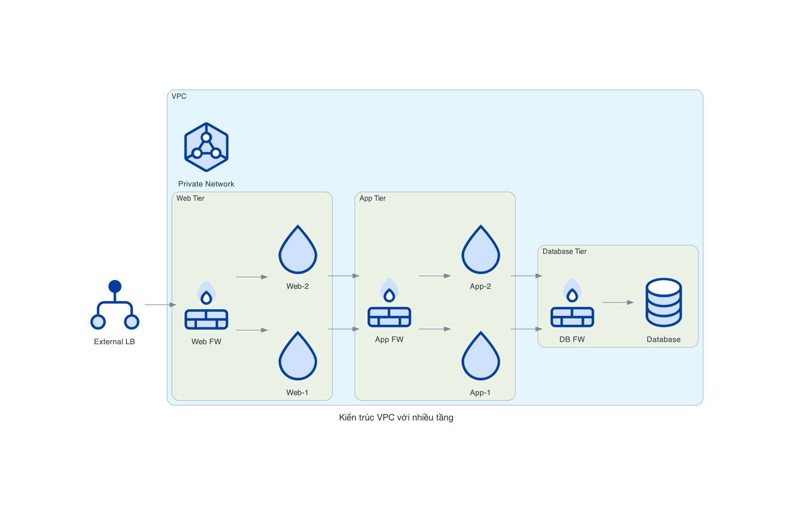
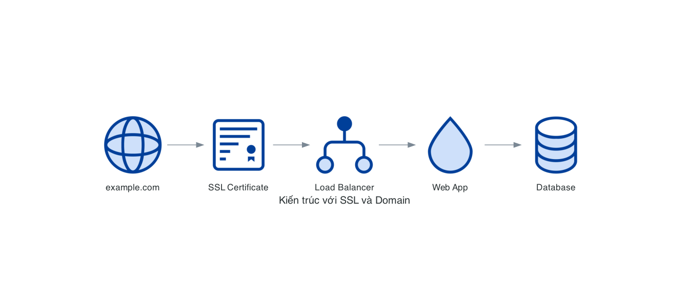
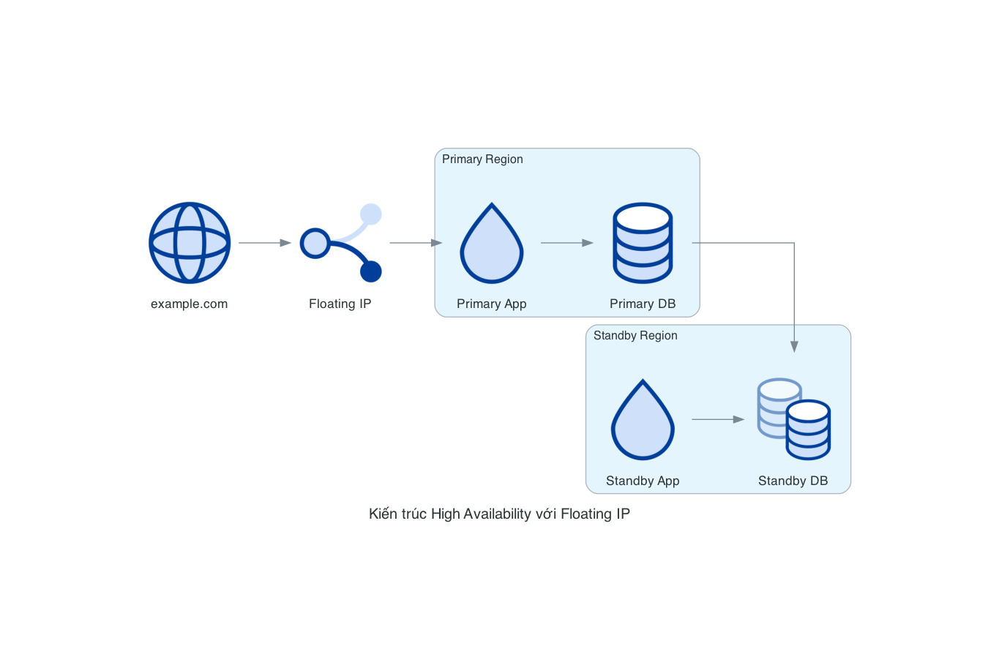

# DigitalOcean Network Nodes

Các nodes Network trong DigitalOcean đại diện cho các dịch vụ mạng như Load Balancer, Firewall, VPC và các dịch vụ liên quan đến domain. Các dịch vụ này giúp quản lý lưu lượng mạng, bảo mật và kết nối giữa các tài nguyên.

## Danh sách Nodes

### LoadBalancer
`LoadBalancer` đại diện cho dịch vụ Load Balancer của DigitalOcean, giúp phân phối lưu lượng truy cập đến các Droplets hoặc Kubernetes clusters.

```python
from diagrams.digitalocean.network import LoadBalancer
```

### Firewall
`Firewall` đại diện cho Cloud Firewalls của DigitalOcean, giúp kiểm soát lưu lượng mạng đến và đi từ các Droplets.

```python
from diagrams.digitalocean.network import Firewall
```

### Vpc
`Vpc` đại diện cho Virtual Private Cloud của DigitalOcean, cung cấp một mạng riêng ảo cho các tài nguyên của bạn.

```python
from diagrams.digitalocean.network import Vpc
```

### Domain
`Domain` đại diện cho dịch vụ quản lý DNS của DigitalOcean, cho phép bạn quản lý các bản ghi DNS cho tên miền của mình.

```python
from diagrams.digitalocean.network import Domain
```

### DomainRegistration
`DomainRegistration` đại diện cho dịch vụ đăng ký tên miền của DigitalOcean.

```python
from diagrams.digitalocean.network import DomainRegistration
```

### Certificate
`Certificate` đại diện cho SSL certificates được quản lý bởi DigitalOcean.

```python
from diagrams.digitalocean.network import Certificate
```

### FloatingIp
`FloatingIp` đại diện cho Floating IP của DigitalOcean, một địa chỉ IP tĩnh có thể được gán cho bất kỳ Droplet nào.

```python
from diagrams.digitalocean.network import FloatingIp
```

### InternetGateway
`InternetGateway` đại diện cho cổng kết nối internet trong VPC của DigitalOcean.

```python
from diagrams.digitalocean.network import InternetGateway
```

### ManagedVpn
`ManagedVpn` đại diện cho dịch vụ VPN được quản lý của DigitalOcean.

```python
from diagrams.digitalocean.network import ManagedVpn
```

## Các Pattern Diagram phổ biến

### 1. Kiến trúc Load Balancing cơ bản

Mô tả một ứng dụng web sử dụng Load Balancer để phân phối lưu lượng:

```python
from diagrams import Diagram, Cluster
from diagrams.digitalocean.compute import Droplet
from diagrams.digitalocean.network import LoadBalancer, Domain
from diagrams.digitalocean.database import DbaasPrimary

with Diagram("Kiến trúc Load Balancing cơ bản", show=False):
    dns = Domain("example.com")
    lb = LoadBalancer("Load Balancer")
    
    with Cluster("Web Servers"):
        web_servers = [Droplet("Web-1"),
                      Droplet("Web-2")]
    
    db = DbaasPrimary("Database")
    
    dns >> lb >> web_servers >> db
```



### 2. Kiến trúc VPC với nhiều tầng

Mô tả một kiến trúc VPC với nhiều tầng ứng dụng:

```python
from diagrams import Diagram, Cluster
from diagrams.digitalocean.compute import Droplet
from diagrams.digitalocean.network import LoadBalancer, Vpc, Firewall
from diagrams.digitalocean.database import DbaasPrimary

with Diagram("Kiến trúc VPC với nhiều tầng", show=False):
    lb = LoadBalancer("External LB")
    
    with Cluster("VPC"):
        vpc = Vpc("Private Network")
        
        with Cluster("Web Tier"):
            fw_web = Firewall("Web FW")
            web_servers = [Droplet("Web-1"),
                          Droplet("Web-2")]
            
            fw_web >> web_servers
        
        with Cluster("App Tier"):
            fw_app = Firewall("App FW")
            app_servers = [Droplet("App-1"),
                          Droplet("App-2")]
            
            fw_app >> app_servers
        
        with Cluster("Database Tier"):
            fw_db = Firewall("DB FW")
            db = DbaasPrimary("Database")
            
            fw_db >> db
    
    lb >> fw_web
    web_servers >> fw_app
    app_servers >> fw_db
```



### 3. Kiến trúc với SSL và Domain

Mô tả một ứng dụng web với SSL và quản lý domain:

```python
from diagrams import Diagram
from diagrams.digitalocean.compute import Droplet
from diagrams.digitalocean.network import LoadBalancer, Domain, Certificate
from diagrams.digitalocean.database import DbaasPrimary

with Diagram("Kiến trúc với SSL và Domain", show=False):
    domain = Domain("example.com")
    cert = Certificate("SSL Certificate")
    lb = LoadBalancer("Load Balancer")
    app = Droplet("Web App")
    db = DbaasPrimary("Database")
    
    domain >> cert >> lb >> app >> db
```



### 4. Kiến trúc High Availability với Floating IP

Mô tả một kiến trúc có tính sẵn sàng cao sử dụng Floating IP:

```python
from diagrams import Diagram, Cluster
from diagrams.digitalocean.compute import Droplet
from diagrams.digitalocean.network import FloatingIp, Domain
from diagrams.digitalocean.database import DbaasPrimary, DbaasStandby

with Diagram("Kiến trúc High Availability với Floating IP", show=False):
    domain = Domain("example.com")
    floating_ip = FloatingIp("Floating IP")
    
    with Cluster("Primary Region"):
        primary_app = Droplet("Primary App")
        primary_db = DbaasPrimary("Primary DB")
        
        primary_app >> primary_db
    
    with Cluster("Standby Region"):
        standby_app = Droplet("Standby App")
        standby_db = DbaasStandby("Standby DB")
        
        standby_app >> standby_db
    
    domain >> floating_ip
    floating_ip >> primary_app
    
    primary_db >> standby_db
```



## Các Best Practices

1. **Sử dụng Firewall cho bảo mật**: Luôn hiển thị các firewall trong sơ đồ để làm rõ các biện pháp bảo mật.
2. **Phân tách các tầng mạng**: Sử dụng clusters để phân tách rõ ràng các tầng mạng khác nhau.
3. **Hiển thị luồng lưu lượng**: Sử dụng mũi tên để hiển thị luồng lưu lượng mạng giữa các thành phần.
4. **Kết hợp với các dịch vụ khác**: Hiển thị cách các dịch vụ mạng tương tác với các dịch vụ compute và database.
