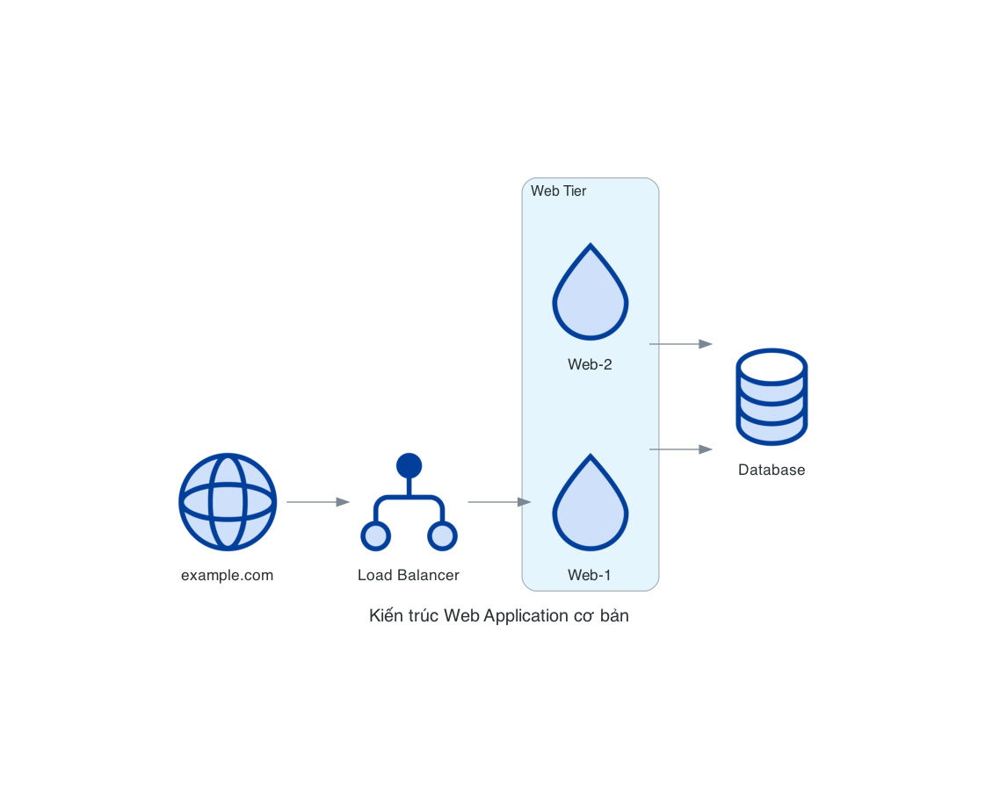
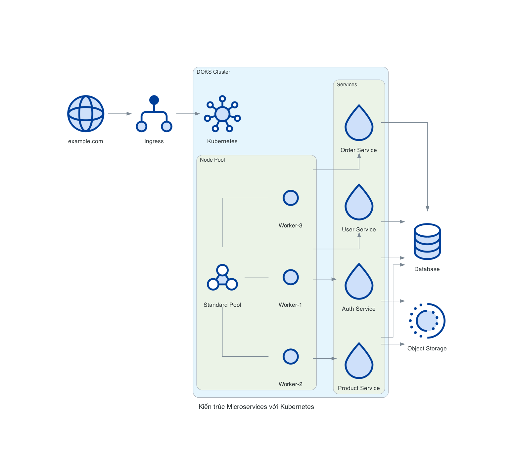
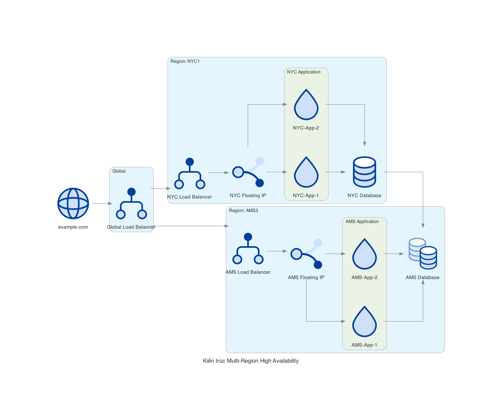
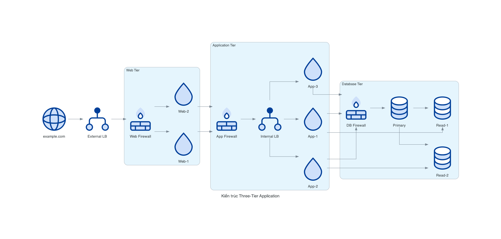
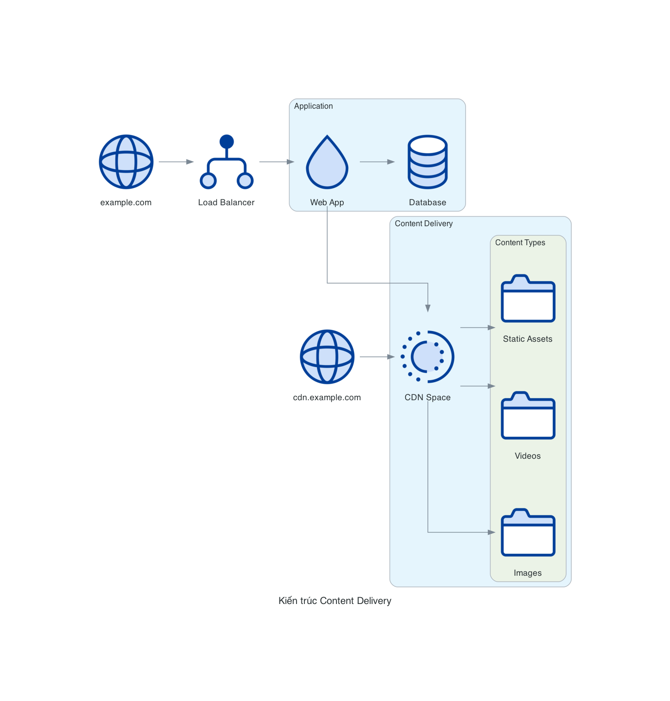
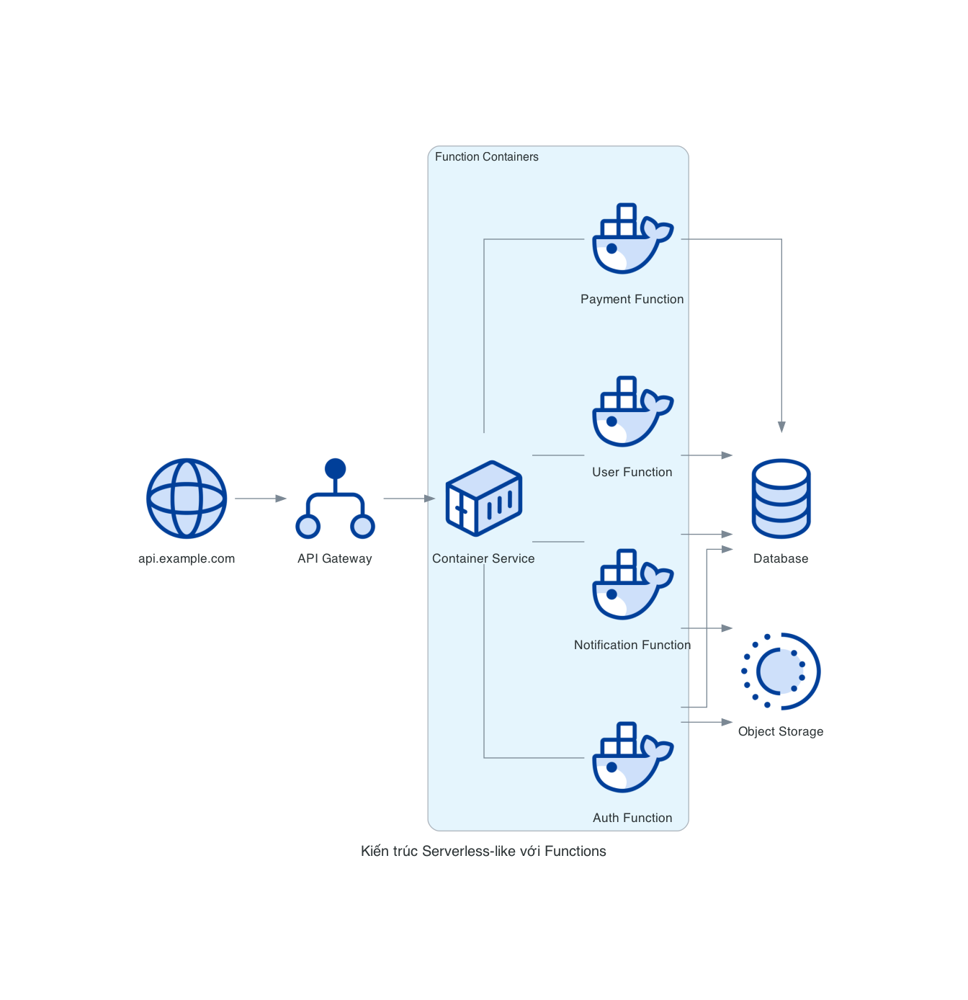
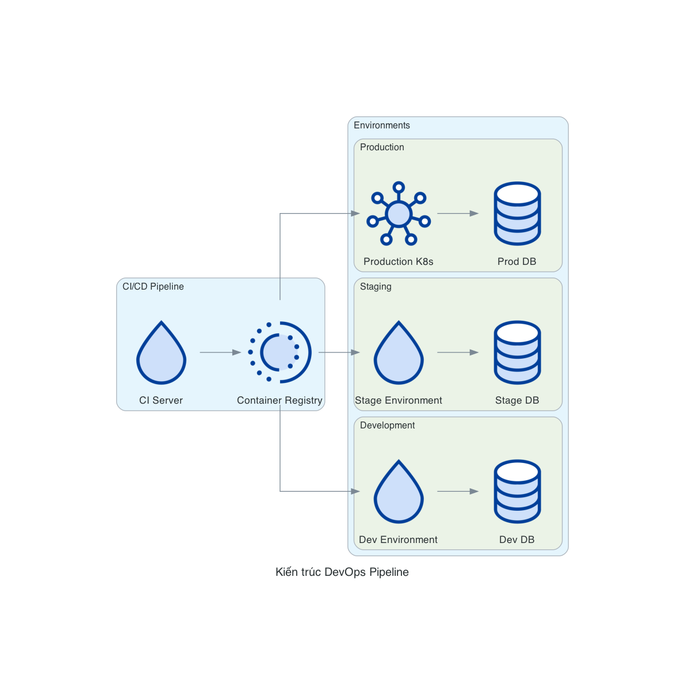

# Pattern Diagram phổ biến

Trong tài liệu này, chúng ta sẽ tìm hiểu về các pattern diagram phổ biến khi sử dụng các nodes DigitalOcean trong thư viện diagrams. Các pattern này đại diện cho các kiến trúc thường gặp khi triển khai ứng dụng trên DigitalOcean.

## 1. Kiến trúc Web Application cơ bản

Đây là kiến trúc cơ bản nhất cho một ứng dụng web, bao gồm một Load Balancer, các Droplets chạy ứng dụng web và một cơ sở dữ liệu.

```python
from diagrams import Diagram, Cluster
from diagrams.digitalocean.compute import Droplet
from diagrams.digitalocean.network import LoadBalancer, Domain
from diagrams.digitalocean.database import DbaasPrimary

with Diagram("Kiến trúc Web Application cơ bản", show=False):
    domain = Domain("example.com")
    lb = LoadBalancer("Load Balancer")

    with Cluster("Web Tier"):
        web = [Droplet("Web-1"),
              Droplet("Web-2")]

    db = DbaasPrimary("Database")

    domain >> lb >> web >> db
```



## 2. Kiến trúc Microservices với Kubernetes

Kiến trúc này sử dụng DigitalOcean Kubernetes Service (DOKS) để triển khai các microservices.

```python
from diagrams import Diagram, Cluster
from diagrams.digitalocean.compute import K8SCluster, K8SNodePool, K8SNode
from diagrams.digitalocean.network import LoadBalancer, Domain
from diagrams.digitalocean.database import DbaasPrimary
from diagrams.digitalocean.storage import Space

with Diagram("Kiến trúc Microservices với Kubernetes", show=False):
    domain = Domain("example.com")
    lb = LoadBalancer("Ingress")

    with Cluster("DOKS Cluster"):
        k8s = K8SCluster("Kubernetes")

        with Cluster("Node Pool"):
            nodes = [K8SNode("Worker-1"),
                    K8SNode("Worker-2"),
                    K8SNode("Worker-3")]

            pool = K8SNodePool("Standard Pool")
            pool - nodes

        with Cluster("Services"):
            services = [
                Cluster("Auth Service"),
                Cluster("User Service"),
                Cluster("Product Service"),
                Cluster("Order Service")
            ]

    db = DbaasPrimary("Database")
    storage = Space("Object Storage")

    domain >> lb >> k8s
    nodes >> services
    services >> db
    services >> storage
```



## 3. Kiến trúc Multi-Region High Availability

Kiến trúc này triển khai ứng dụng trên nhiều vùng để đảm bảo tính sẵn sàng cao.

```python
from diagrams import Diagram, Cluster
from diagrams.digitalocean.compute import Droplet
from diagrams.digitalocean.network import LoadBalancer, Domain, FloatingIp
from diagrams.digitalocean.database import DbaasPrimary, DbaasStandby

with Diagram("Kiến trúc Multi-Region High Availability", show=False):
    domain = Domain("example.com")

    with Cluster("Global"):
        lb = LoadBalancer("Global Load Balancer")

    with Cluster("Region: NYC1"):
        nyc_lb = LoadBalancer("NYC Load Balancer")
        nyc_ip = FloatingIp("NYC Floating IP")

        with Cluster("NYC Application"):
            nyc_apps = [Droplet("NYC-App-1"),
                       Droplet("NYC-App-2")]

        nyc_db = DbaasPrimary("NYC Database")

        nyc_lb >> nyc_ip >> nyc_apps >> nyc_db

    with Cluster("Region: AMS3"):
        ams_lb = LoadBalancer("AMS Load Balancer")
        ams_ip = FloatingIp("AMS Floating IP")

        with Cluster("AMS Application"):
            ams_apps = [Droplet("AMS-App-1"),
                       Droplet("AMS-App-2")]

        ams_db = DbaasStandby("AMS Database")

        ams_lb >> ams_ip >> ams_apps >> ams_db

    domain >> lb
    lb >> [nyc_lb, ams_lb]
    nyc_db >> ams_db
```



## 4. Kiến trúc Three-Tier Application

Kiến trúc ba tầng truyền thống với tầng web, tầng ứng dụng và tầng cơ sở dữ liệu.

```python
from diagrams import Diagram, Cluster
from diagrams.digitalocean.compute import Droplet
from diagrams.digitalocean.network import LoadBalancer, Domain, Firewall
from diagrams.digitalocean.database import DbaasPrimary, DbaasReadOnly

with Diagram("Kiến trúc Three-Tier Application", show=False):
    domain = Domain("example.com")
    ext_lb = LoadBalancer("External LB")

    with Cluster("Web Tier"):
        web_fw = Firewall("Web Firewall")
        web_servers = [Droplet("Web-1"),
                      Droplet("Web-2")]

        web_fw >> web_servers

    with Cluster("Application Tier"):
        app_fw = Firewall("App Firewall")
        app_lb = LoadBalancer("Internal LB")
        app_servers = [Droplet("App-1"),
                      Droplet("App-2"),
                      Droplet("App-3")]

        app_fw >> app_lb >> app_servers

    with Cluster("Database Tier"):
        db_fw = Firewall("DB Firewall")
        primary = DbaasPrimary("Primary")
        replicas = [DbaasReadOnly("Read-1"),
                   DbaasReadOnly("Read-2")]

        db_fw >> primary
        primary >> replicas

    domain >> ext_lb >> web_fw
    web_servers >> app_fw
    app_servers >> db_fw
    app_servers >> replicas
```



## 5. Kiến trúc Content Delivery

Kiến trúc này tập trung vào việc phân phối nội dung sử dụng Spaces và CDN.

```python
from diagrams import Diagram, Cluster
from diagrams.digitalocean.compute import Droplet
from diagrams.digitalocean.network import LoadBalancer, Domain
from diagrams.digitalocean.storage import Space, Folder
from diagrams.digitalocean.database import DbaasPrimary

with Diagram("Kiến trúc Content Delivery", show=False):
    user_domain = Domain("example.com")
    cdn_domain = Domain("cdn.example.com")

    lb = LoadBalancer("Load Balancer")

    with Cluster("Application"):
        app = Droplet("Web App")
        db = DbaasPrimary("Database")

        app >> db

    with Cluster("Content Delivery"):
        space = Space("CDN Space")

        with Cluster("Content Types"):
            images = Folder("Images")
            videos = Folder("Videos")
            assets = Folder("Static Assets")

            space >> [images, videos, assets]

    user_domain >> lb >> app
    cdn_domain >> space
    app >> space
```



## 6. Kiến trúc Serverless-like với Functions

Mặc dù DigitalOcean không có dịch vụ serverless chính thức, nhưng bạn có thể mô phỏng kiến trúc serverless bằng cách sử dụng các containers nhỏ.

```python
from diagrams import Diagram, Cluster
from diagrams.digitalocean.compute import Containers, Docker
from diagrams.digitalocean.network import LoadBalancer, Domain
from diagrams.digitalocean.database import DbaasPrimary
from diagrams.digitalocean.storage import Space

with Diagram("Kiến trúc Serverless-like với Functions", show=False):
    domain = Domain("api.example.com")
    lb = LoadBalancer("API Gateway")

    with Cluster("Function Containers"):
        functions = [
            Docker("Auth Function"),
            Docker("User Function"),
            Docker("Payment Function"),
            Docker("Notification Function")
        ]

        container_service = Containers("Container Service")
        container_service - functions

    db = DbaasPrimary("Database")
    storage = Space("Object Storage")

    domain >> lb >> container_service
    functions >> db
    functions >> storage
```



## 7. Kiến trúc DevOps Pipeline

Kiến trúc này mô tả một pipeline CI/CD sử dụng các tài nguyên DigitalOcean.

```python
from diagrams import Diagram, Cluster, Edge
from diagrams.digitalocean.compute import Droplet, K8SCluster
from diagrams.digitalocean.storage import Space
from diagrams.digitalocean.database import DbaasPrimary

with Diagram("Kiến trúc DevOps Pipeline", show=False):
    with Cluster("CI/CD Pipeline"):
        ci = Droplet("CI Server")
        registry = Space("Container Registry")

        ci >> registry

    with Cluster("Environments"):
        with Cluster("Development"):
            dev = Droplet("Dev Environment")
            dev_db = DbaasPrimary("Dev DB")

            dev >> dev_db

        with Cluster("Staging"):
            stage = Droplet("Stage Environment")
            stage_db = DbaasPrimary("Stage DB")

            stage >> stage_db

        with Cluster("Production"):
            prod = K8SCluster("Production K8s")
            prod_db = DbaasPrimary("Prod DB")

            prod >> prod_db

    registry >> dev
    registry >> stage
    registry >> prod
```



## Các Best Practices khi thiết kế Diagram

1. **Sử dụng Clusters để nhóm các thành phần liên quan**: Điều này giúp làm rõ cấu trúc của hệ thống và mối quan hệ giữa các thành phần.

2. **Hiển thị luồng dữ liệu bằng mũi tên**: Sử dụng mũi tên để hiển thị luồng dữ liệu hoặc phụ thuộc giữa các thành phần.

3. **Sử dụng màu sắc có ý nghĩa**: Tùy chỉnh màu sắc của các nodes để phân biệt giữa các môi trường hoặc vai trò khác nhau.

4. **Đặt tên rõ ràng cho các thành phần**: Đảm bảo rằng mỗi node có một tên mô tả rõ ràng về chức năng của nó.

5. **Giữ sơ đồ đơn giản**: Tránh quá nhiều chi tiết trong một sơ đồ. Nếu cần, hãy chia thành nhiều sơ đồ nhỏ hơn.

6. **Hiển thị các biện pháp bảo mật**: Luôn hiển thị các firewall và các biện pháp bảo mật khác trong sơ đồ.

7. **Kết hợp các loại nodes khác nhau**: Kết hợp các nodes từ các nhóm khác nhau (compute, database, network, storage) để tạo ra một sơ đồ hoàn chỉnh.
