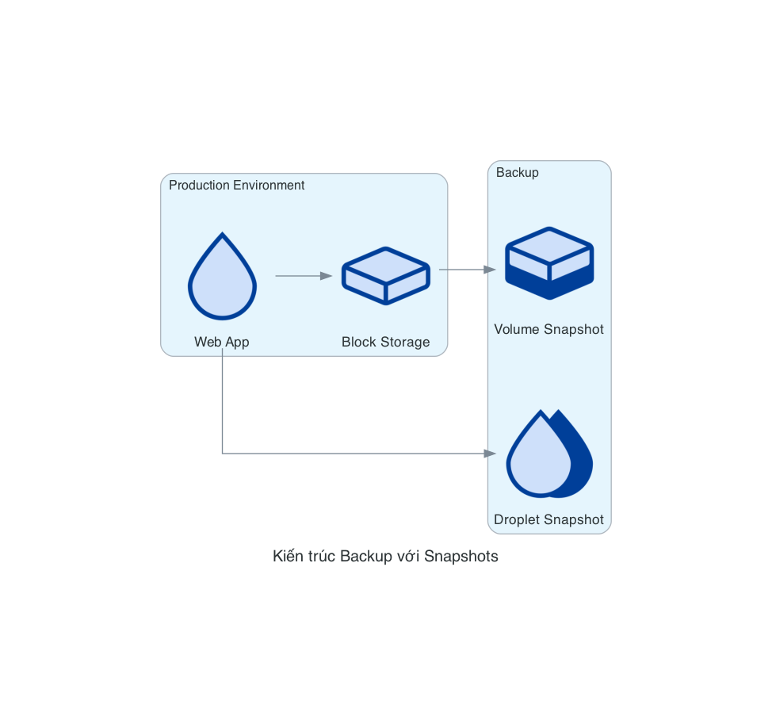

# DigitalOcean Storage Nodes

Các nodes Storage trong DigitalOcean đại diện cho các dịch vụ lưu trữ như Block Storage (Volumes) và Object Storage (Spaces). Các dịch vụ này cung cấp các giải pháp lưu trữ linh hoạt và có thể mở rộng cho các ứng dụng của bạn.

## Danh sách Nodes

### Volume
`Volume` đại diện cho Block Storage Volumes của DigitalOcean, cung cấp lưu trữ khối có thể được gắn vào Droplets.

```python
from diagrams.digitalocean.storage import Volume
```

### VolumeSnapshot
`VolumeSnapshot` đại diện cho bản snapshot của một Volume, cho phép bạn sao lưu dữ liệu tại một thời điểm cụ thể.

```python
from diagrams.digitalocean.storage import VolumeSnapshot
```

### Space
`Space` đại diện cho DigitalOcean Spaces, dịch vụ lưu trữ đối tượng tương tự như Amazon S3.

```python
from diagrams.digitalocean.storage import Space
```

### Folder
`Folder` đại diện cho một thư mục trong DigitalOcean Spaces.

```python
from diagrams.digitalocean.storage import Folder
```

## Các Pattern Diagram phổ biến

### 1. Droplet với Block Storage

Mô tả một Droplet sử dụng Block Storage để lưu trữ dữ liệu:

```python
from diagrams import Diagram
from diagrams.digitalocean.compute import Droplet
from diagrams.digitalocean.storage import Volume

with Diagram("Droplet với Block Storage", show=False):
    app = Droplet("Web App")
    storage = Volume("Block Storage")
    
    app >> storage
```


### 2. Ứng dụng với Object Storage

Mô tả một ứng dụng sử dụng Object Storage để lưu trữ và phân phối nội dung:

```python
from diagrams import Diagram
from diagrams.digitalocean.compute import Droplet
from diagrams.digitalocean.storage import Space
from diagrams.digitalocean.network import LoadBalancer

with Diagram("Ứng dụng với Object Storage", show=False):
    lb = LoadBalancer("Load Balancer")
    app = Droplet("Web App")
    storage = Space("Object Storage")
    
    lb >> app
    app >> storage
```


### 3. Kiến trúc Backup với Snapshots

Mô tả một kiến trúc sử dụng snapshots để sao lưu dữ liệu:

```python
from diagrams import Diagram, Cluster
from diagrams.digitalocean.compute import Droplet, DropletSnapshot
from diagrams.digitalocean.storage import Volume, VolumeSnapshot

with Diagram("Kiến trúc Backup với Snapshots", show=False):
    with Cluster("Production Environment"):
        app = Droplet("Web App")
        storage = Volume("Block Storage")
        
        app >> storage
    
    with Cluster("Backup"):
        app_snapshot = DropletSnapshot("Droplet Snapshot")
        storage_snapshot = VolumeSnapshot("Volume Snapshot")
        
        app >> app_snapshot
        storage >> storage_snapshot
```



### 4. Kiến trúc Content Delivery với Spaces

Mô tả một kiến trúc phân phối nội dung sử dụng Spaces:

```python
from diagrams import Diagram, Cluster
from diagrams.digitalocean.compute import Droplet
from diagrams.digitalocean.storage import Space, Folder
from diagrams.digitalocean.network import LoadBalancer, Domain

with Diagram("Kiến trúc Content Delivery với Spaces", show=False):
    domain = Domain("cdn.example.com")
    
    with Cluster("Application"):
        lb = LoadBalancer("Load Balancer")
        app = Droplet("Web App")
        
        lb >> app
    
    with Cluster("Object Storage"):
        space = Space("CDN Space")
        
        with Cluster("Content"):
            images = Folder("Images")
            videos = Folder("Videos")
            static = Folder("Static Files")
            
            space >> [images, videos, static]
    
    domain >> space
    app >> space
```


## Các Best Practices

1. **Phân tách lưu trữ theo loại**: Sử dụng các loại lưu trữ khác nhau cho các loại dữ liệu khác nhau (Block Storage cho cơ sở dữ liệu, Object Storage cho nội dung tĩnh).
2. **Hiển thị chiến lược sao lưu**: Luôn hiển thị các snapshots và chiến lược sao lưu trong sơ đồ.
3. **Tổ chức nội dung trong Object Storage**: Sử dụng Folder nodes để hiển thị cách tổ chức nội dung trong Spaces.
4. **Kết hợp với CDN**: Hiển thị cách Spaces có thể được sử dụng kết hợp với CDN để phân phối nội dung.
